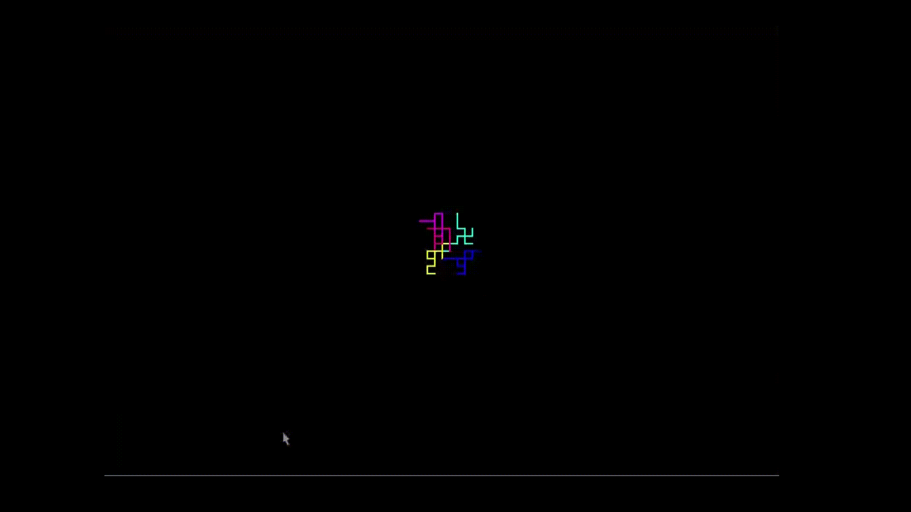

# Random Walk Simulator

A colorful random walk visualization using SDL2.



## Features

- Multiple agents moving independently in random directions
- Vibrant HSL-based color generation for each agent
- Real-time SDL2 visualization
- Configurable number of agents

## Building

Requires SDL2 development libraries:

```bash
sudo apt install libsdl2-dev
```

Build with:

```bash
make              # Standard build
make debug        # Debug build with symbols
make strict       # Build with all warnings as errors
```

## Usage

```bash
./RandomWalk <num_agents>
```

Examples:
```bash
./RandomWalk       # Run with 5 agents (default)
./RandomWalk 100   # Run with 100 agents
```

## Project Structure

- `main.c` - Entry point and main event loop
- `RandomWalk.c` / `RandomWalk.h` - Random walk logic and agent management
- `ColorFormat/` - HSL to RGB color conversion utilities

## Third-Party Code

This project includes color conversion code from:
- **ColorFormat** by [Maciej Ciemborowicz](https://maciej-ciemborowicz.eu)
- Original source: https://github.com/maciejciemborowicz/ColorFormat
- Licensed under Apache License 2.0
- Modified by Gabe Gamble, 2025 - Split into header/source files

## License

Copyright 2025 Gabe Gamble

Licensed under the Apache License, Version 2.0. See [LICENSE](LICENSE) for details.

## Author

Gabe Gamble - December 25, 2025
